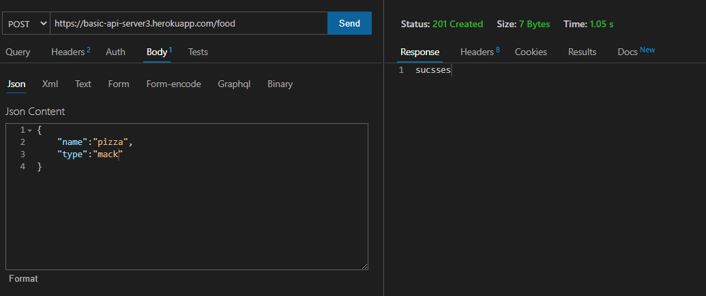
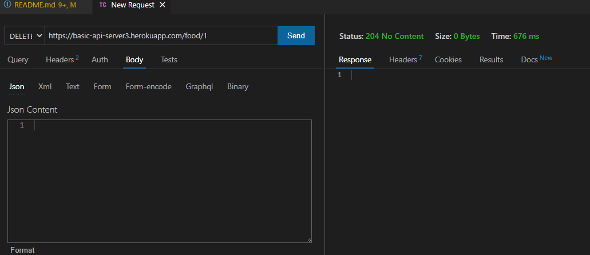
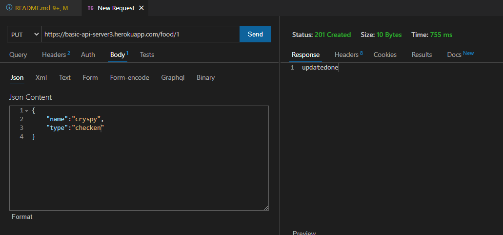

# basic-api-server

## 🚀 heroku link
https://basic-api-server3.herokuapp.com/food
## 🚀 project link
https://github.com/lithhalim/basic-api-server
## 🚀 pull request
https://github.com/lithhalim/basic-api-server/pulls
## 🚀 action
https://github.com/lithhalim/basic-api-server/actions

## How To Use
- add new type food

- delete one food element

- update one element food

- npm test check

## DECMUNTATION

- Create a new repository called basic-api-server
- CRUD Operation: Create
- CRUD Operation: Read
- Update A Record
- CRUD Operation: Destroy

#### Implementation Notes
 ###### REMINDER: Your app needs a new dependency today: sequelize
 - npm i sequelize sequelize-cli pg sqlite3
 - Remember to start your Postgres server:

